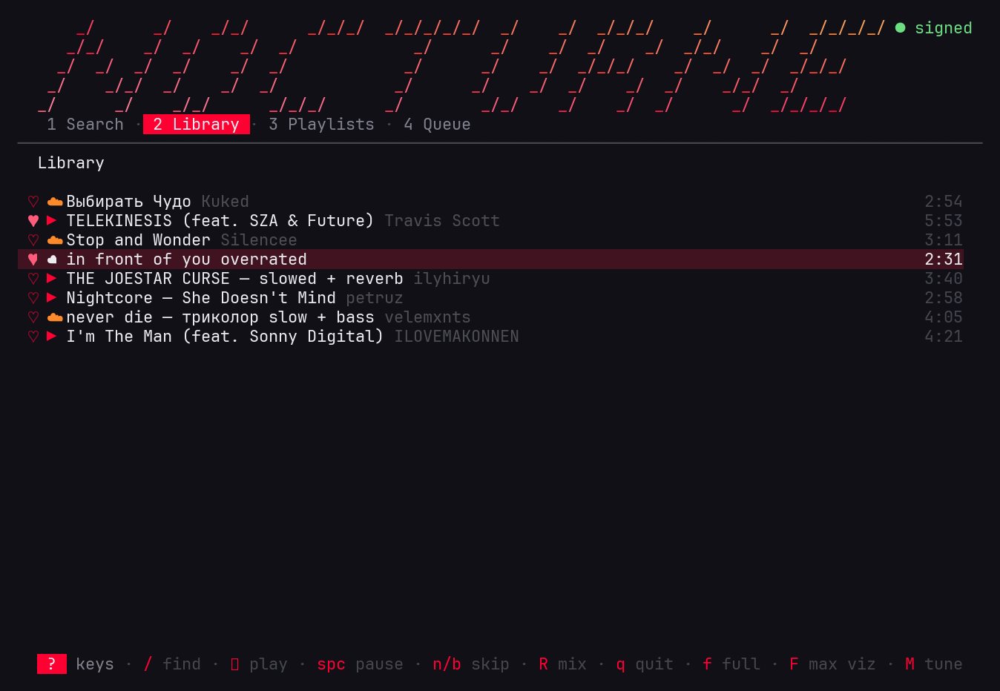
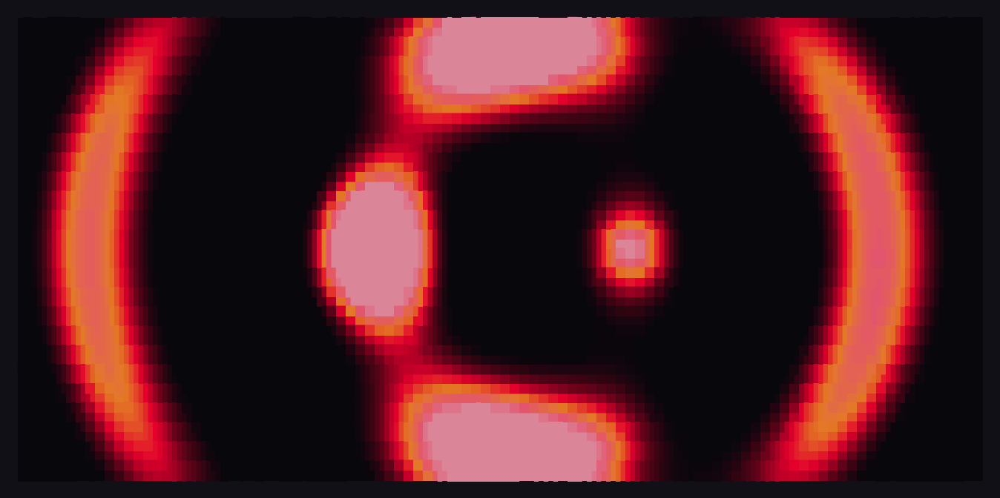

# ytm

YouTube Music in the terminal. mpv handles playback, [ytmusicapi](https://github.com/sigma67/ytmusicapi)
talks to your account, and the visualizer is a real FFT of whatever is coming
out of your speakers (it taps the PipeWire monitor with parec, so it reacts to
the actual audio, not a fake animation).



Album art gets rendered as truecolor half-blocks, search results start a radio
so the music keeps going, and your library/playlists/likes work once you're
signed in. Works fine without an account too, you just lose the library stuff.

The `drop` visualizer is a milkdrop-style plasma — thirty-six field equations
that morph and crossfade to the beat, driven by the real audio spectrum. Its
sibling `cover` is the same engine painted with the current album's colors:



## install

You need `mpv`, `yt-dlp` and `ffmpeg` on your system. On Arch:

```sh
sudo pacman -S mpv yt-dlp ffmpeg
```

Then:

```sh
git clone https://github.com/jprouhana/ytm-tui
cd ytm-tui
./install.sh
```

That sets up a venv, drops a `ytm` launcher into `~/.local/bin`, and offers
to sign you in. Then `ytm setup` walks the rest — dependency check, account,
theme, visualizer flavor, search style — in one pass.

**On Windows?** It runs through WSL — there's a gentle, no-experience
walkthrough at [docs/INSTALL-WINDOWS.md](docs/INSTALL-WINDOWS.md).

## signing in

```sh
ytm --login
```

Pick the browser you're logged into music.youtube.com with and it lifts the
session out of its cookie store — firefox, chrome, chromium, brave, edge,
vivaldi and opera all work (the chromium-family cookie decryption is handled
by yt-dlp, keyring and all).

If that somehow fails there's a manual fallback: `ytm --auth`, then paste
the request headers from any network request on music.youtube.com
(F12 → Network → filter "browse" → copy request headers).

Auth lands in `~/.config/ytm-tui/browser.json`, chmod 600, and never leaves
your machine. Skipping sign-in is fine too — search and playback work in
guest mode.

`ytm --doctor` checks that everything is wired up.

## keys

| key | | key | |
|-----|------------|-----|------------|
| `/` | search | `space` | play/pause |
| `enter` | play | `n` / `b` | next / prev |
| `j` `k` / arrows | move | `,` / `.` | seek 10s |
| `a` | add to queue | `+` / `-` | volume |
| `A` | add track to a playlist | `N` | new playlist |
| `x` | remove (queue/liked/playlist) | `D``D` | delete playlist |
| `L` | like / unlike (toggles) | `m` | mute |
| `s` | shuffle queue | `r` | repeat |
| `v` | cycle visualizer | `c` | cycle color theme |
| `w` | work mode (no art) | `f` | fullscreen |
| `p` | pixel quality: chunky / hi-def / pixel | `F` | maximize the visualizer |
| `M` | tuning menu (sliders) | `[` `]` `{` `}` | beat punch / flow speed |
| `1`-`4` / `tab` | switch view | `esc` / `h` | back out of playlist |
| `q` | quit | | |

## notes

- search results show album thumbnails and a second info line (toggle
  "rich search" in the `M` menu if you prefer dense single-line results).
- the spectrum is 45 Hz to 11 kHz, log-spaced, with auto gain. bars have
  gravity and peak caps like cava. if there's no pulse/pipewire monitor to
  grab it falls back to a decorative wave.
- the `drop` visualizer cycles through 36 field equations milkdrop-style
  (radial, lattice, honeycomb, fractal — many roll an off-center origin),
  crossfading every 12–24s or early when the bass hits hard. `p` cycles
  pixel quality: chunky half-blocks, hi-def quadrants, or — in kitty,
  ghostty and wezterm — pixel: the field blitted as a true RGB bitmap
  over the kitty graphics protocol, real screen pixels with no block
  characters at all.
  everything is anti-aliased and eased between frames, so dense spots
  (a swirl core) stay smooth instead of strobing. the drop runs flat out
  while it owns the screen — frame cadence is held constant (render cost
  is subtracted from the tick), and pixel mode auto-tunes its resolution
  to whatever your machine sustains.
- the plasma is beat-locked: it tracks bass kicks and the song's tempo,
  so the field punches in on the beat and bobs with the groove instead of
  flickering at every spectrum wiggle. mids and highs have their own
  transient detectors — vocal swells surge the flow, hi-hats spark the
  fine detail and brightness. `[` `]` tune how hard the beat
  hits, `{` `}` tune the base flow speed — or just press `M` for a
  slider menu (beat punch, flow speed, morph speed, pixel quality) that
  floats over the running visualizer. everything sticks across restarts.
  `F` hands the whole terminal to the visualizer.
- you can embed the visualizer in an [eww](https://github.com/elkowar/eww)
  widget — see [docs/EWW-WIDGET.md](docs/EWW-WIDGET.md).
- if playback suddenly breaks it's basically always yt-dlp being out of
  date. update it and try again.
- ytmusicapi 1.12.x sometimes chokes on filtered search for signed-in
  accounts (`KeyError: musicShelfRenderer`), so search falls back to
  unfiltered results when that happens. you might see an album or video
  mixed in, they play fine.
